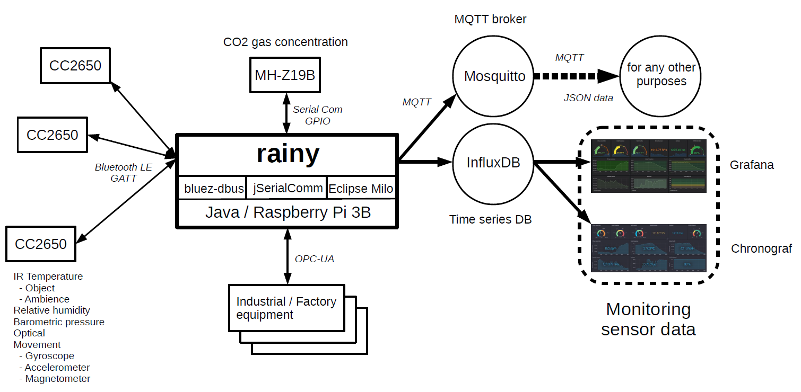
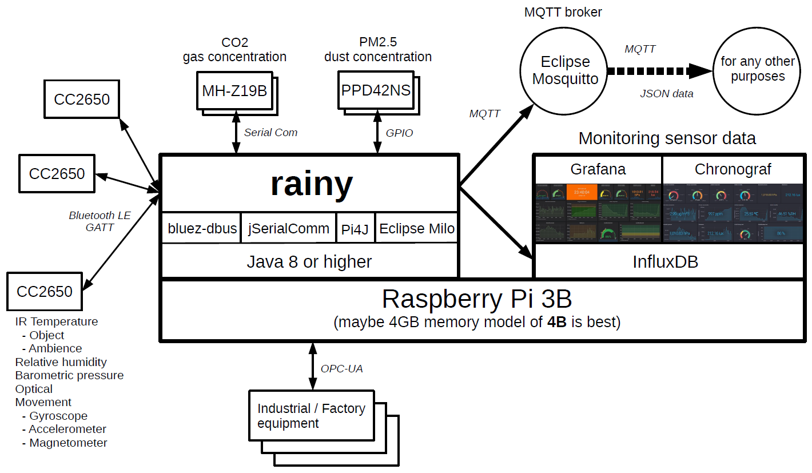
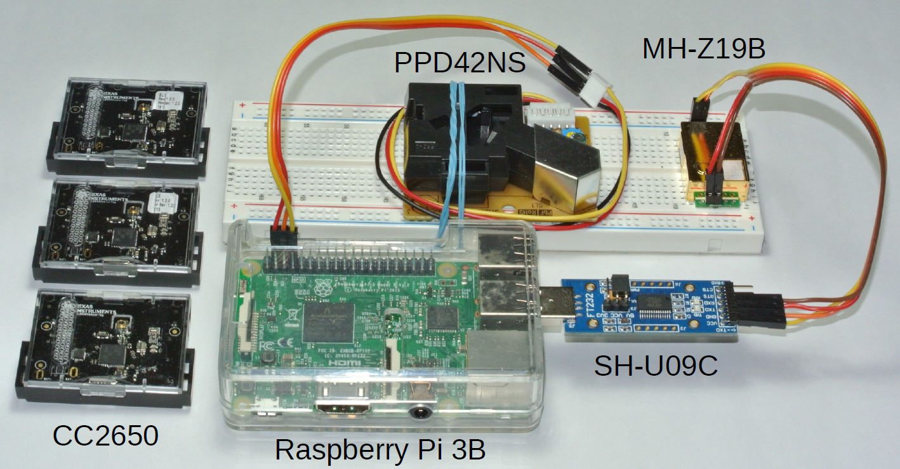
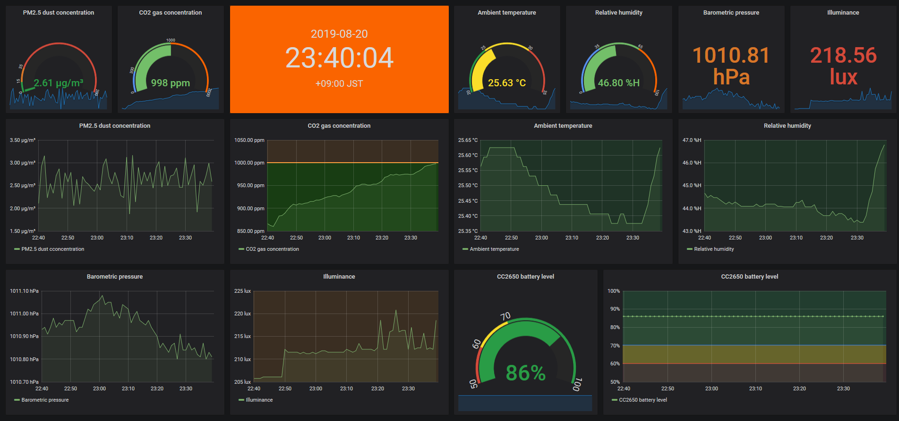
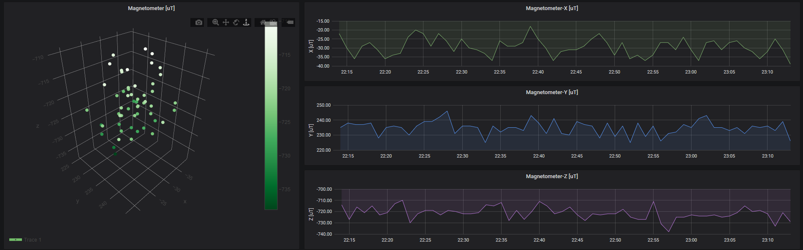
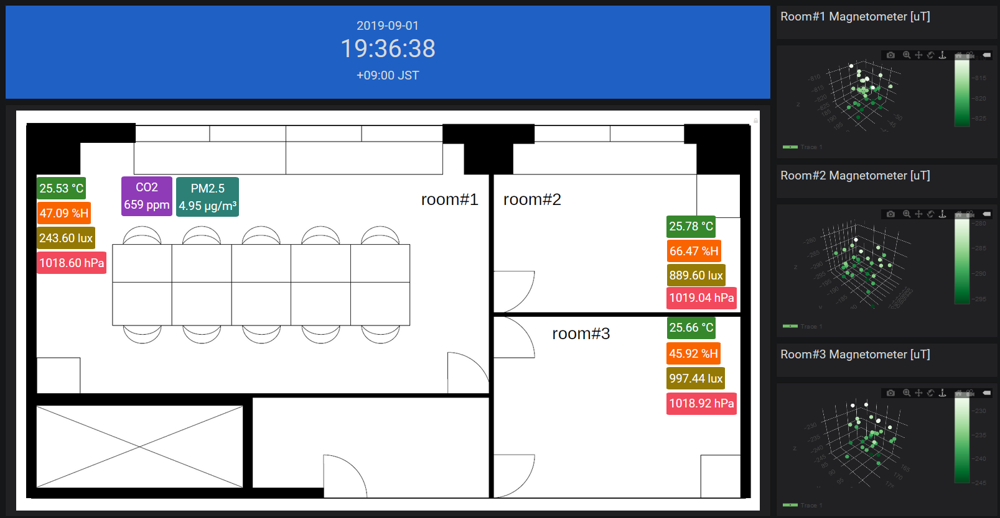
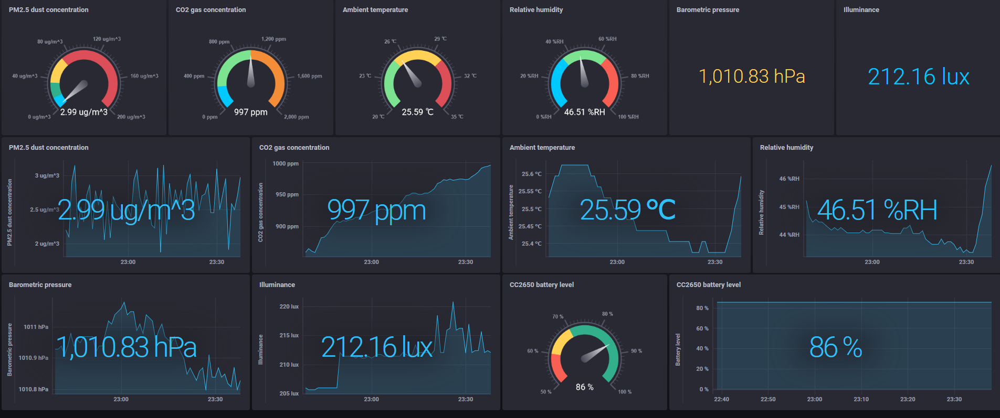
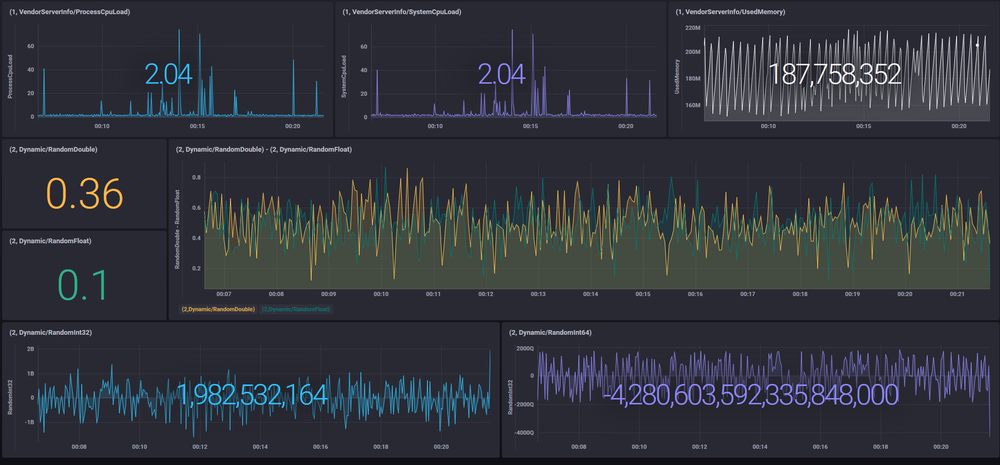

# rainy - a tiny tool for iot data collection and monitoring
rainy is a tiny tool for IoT data collection and monitoring.
rainy supports [TI SensorTag CC2650](http://processors.wiki.ti.com/index.php/CC2650_SensorTag_User's_Guide), [MH-Z19B](https://www.winsen-sensor.com/d/files/infrared-gas-sensor/mh-z19b-co2-ver1_0.pdf) and [PPD42NS](http://wiki.seeedstudio.com/Grove-Dust_Sensor/) as IoT devices, communicates with CC2650 by [bluez-dbus](https://github.com/hypfvieh/bluez-dbus), and communicates with MH-Z19B by [jSerialComm](https://github.com/Fazecast/jSerialComm),
and communicates with PPD42NS by [Pi4J](https://pi4j.com/) and acquires each data.
And it corresponds to OPC-UA which is a protocol of industrial automation.
I use [Eclipse Milo](https://github.com/eclipse/milo) for the OPC-UA Protocol Stack and SDK (Java).
These data can be sent to [InfluxDB](https://www.influxdata.com/) (Time Series Database) for visualization, or sent to MQTT Broker to be used as a data source for any other purposes.

rainy runs on [Apache Felix](https://felix.apache.org/) (OSGi). I think that rainy can be embedded in the environment without OSGi.

I releases this in the form of the Eclipse plug-in project and **this tool -** [**rainy-felix.zip**](https://github.com/s5uishida/rainy/releases).
The list of my source codes and third party bundles is [Bundle list](#bundle_list).
You need Java 8 or higher.
I have confirmed that it works in Raspberry Pi 3B ([Raspbian Buster Lite OS](https://www.raspberrypi.org/downloads/raspbian/) (2019-07-10)).

The following figure is overview of rainy.

</img>

The following figure is overview which the monitoring is running together with rainy on same Raspberry Pi 3B.

</img>

The following image shows the hardware configuration.

</img>

---
<h2>Table of Contents</h2>

- [Purpose](#purpose)
- [Setup OS](#setup_os)
- [Setup sending data](#setup_sending_data)
  - [Install InfluxDB and startup](#install_influxdb)
  - [Install Mosquitto (MQTT Broker) and startup](#install_mosquitto)
- [Setup visualization tools](#install_visualization)
  - [Install Grafana and startup](#install_grafana)
  - [Install Chronograf and startup](#install_chronograf)
  - [Testing HTTPS connection with self-signed certificate](#test_https_connection)
    - [Create a self-signed certificate and private key with file names cert.pem and cert.key](#create_self_signed_cert)
    - [Create /etc/rainy directory and place these files there](#create_directory)
    - [Setting Grafana HTTPS connetion](#set_grafana_https)
    - [Setting Chronograf HTTPS connetion](#set_chronograf_https)
- [Configuration - rainy/conf](#configuration)
  - [rainy.properties](#rainy_properties)
  - [Setting the connection for sending data](#setting_connection_sending_data)
    - [InfluxDB - influxdb.properties](#influxdb_properties)
    - [MQTT - mqtt.properties](#mqtt_properties)
  - [Setting sensors](#setting_sensors)
    - [CC2650 - cc2650.properties](#cc2650_properties)
    - [MH-Z19B - mhz19b.properties](#mhz19b_properties)
    - [PPD42NS - ppd42ns.properties](#ppd42ns_properties)
    - [OPC-UA - opcua.properties](#opcua_properties)
      - [OPC-UA server - conf/opcua/milo-public-demo.properties](#opcua_server_properties)
- [Run rainy](#run_rainy)
  - [Output sensor values to the log file](#output_sensor_value)
  - [Check the database name for each device created in InfluxDB](#check_database)
- [Create dashboards with visualization tools](#create_dashboards)
  - [Case Grafana](#case_grafana)
  - [Case Chronograf](#case_chronograf)
- [Check the data sent to MQTT broker](#check_mqtt_data)
- [Limitations](#limitations)
- [Bundle list](#bundle_list)
- [P.S.](#ps)

---

<h2 id="purpose">Purpose</h2>

The purpose of this tool is briefly as follows.

- For private / office / factory room, easily collect general environmental information and industrial / factory equipment running information via OPC-UA.
- Real-time monitoring and convert these information to MQTT as a data source for any other purposes.
- Runs as Java / OSGi application on Raspberry Pi 3B (arm) and Ubuntu machine (amd64).

Although I think the functionality and performance of this tool are not sufficient for formal operation, it may be an easy-to-try tool.

<h2 id="setup_os">Setup OS</h2>

Please refer to [here1](https://github.com/s5uishida/mh-z19b-driver) and
[here2](https://github.com/s5uishida/ppd42ns-driver) for setting RaspberryPi 3B as an environment for running rainy.
Both Bluetooth and serial communication / GPIO can be enabled.

<h2 id="setup_sending_data">Setup sending data</h2>

rainy supports InfluxDB and MQTT broker as sending data.

<h3 id="install_influxdb">Install InfluxDB and startup</h3>

I am using [InfluxDB](https://www.influxdata.com/) on Ubuntu 18.04.
The installation is as follows from [here](https://portal.influxdata.com/downloads/).
```
# wget https://dl.influxdata.com/influxdb/releases/influxdb_1.7.8_amd64.deb
# dpkg -i influxdb_1.7.8_amd64.deb
# systemctl enable influxdb.service
# systemctl start influxdb.service
```
In addition, the step to install InfluxDB on Raspberry Pi 3B is as follows.
```
# wget https://dl.influxdata.com/influxdb/releases/influxdb_1.7.8_armhf.deb
# dpkg -i influxdb_1.7.8_armhf.deb
# systemctl enable influxdb.service
# systemctl start influxdb.service
```

<h3 id="install_mosquitto">Install Mosquitto (MQTT Broker) and startup</h3>

I am using [Mosquitto](https://mosquitto.org/) as MQTT broker on Ubuntu 18.04.
The installation is as follows.
```
# apt-get update
# apt-get install mosquitto
# apt-get install mosquitto-clients
# systemctl enable mosquitto.service
# systemctl start mosquitto.service
```
In addition, the step to install Mosquitto on Raspberry Pi 3B is the same as above.

<h2 id="install_visualization">Setup visualization tools</h2>

<h3 id="install_grafana">Install Grafana and startup</h3>

I am using [Grafana](https://grafana.com/) on Ubuntu 18.04. The installation is as follows from [here](https://grafana.com/grafana/download?platform=linux).
```
# wget https://dl.grafana.com/oss/release/grafana_6.3.4_amd64.deb
# dpkg -i grafana_6.3.4_amd64.deb
# systemctl enable grafana-server.service
# systemctl start grafana-server.service
```
In addition, the step to install Grafana on Raspberry Pi 3B is as follows.
```
# wget https://dl.grafana.com/oss/release/grafana_6.3.4_armhf.deb
# dpkg -i grafana_6.3.4_armhf.deb
# systemctl enable grafana-server.service
# systemctl start grafana-server.service
```

<h3 id="install_chronograf">Install Chronograf and startup</h3>

I am using [Chronograf](https://www.influxdata.com/time-series-platform/chronograf/) on Ubuntu 18.04. The installation is as follows from [here](https://portal.influxdata.com/downloads/).
```
# wget https://dl.influxdata.com/chronograf/releases/chronograf_1.7.14_amd64.deb
# dpkg -i chronograf_1.7.14_amd64.deb
# systemctl enable chronograf.service
# systemctl start chronograf.service
```
In addition, the step to install Chronograf on Raspberry Pi 3B is as follows.
```
# wget https://dl.influxdata.com/chronograf/releases/chronograf_1.7.14_armhf.deb
# dpkg -i chronograf_1.7.14_armhf.deb
# systemctl enable chronograf.service
# systemctl start chronograf.service
```

<h3 id="test_https_connection">Testing HTTPS connection with self-signed certificate</h3>

In general, it is not recommended to use a self-signed certificate for formal operation, but it is sufficient for testing purposes.

<h4 id="create_self_signed_cert">Create a self-signed certificate and private key with file names cert.pem and cert.key</h4>

```
# openssl req -x509 -newkey rsa:4096 -sha256 -nodes -keyout cert.key -out cert.pem -subj "/CN=localhost" -days 365
```

<h4 id="create_directory">Create /etc/rainy directory and place these files there</h4>

```
# mkdir /etc/rainy
# cp cert.pem cert.key /etc/rainy/
# cd /etc/rainy
# chmod 0644 cert.pem cert.key
```

<h4 id="set_grafana_https">Setting Grafana HTTPS connetion</h4>

See [here](https://grafana.com/docs/installation/configuration/) for details.

- Edit `/etc/grafana/grafana.ini`  
```
@@ -29,7 +29,7 @@
 #################################### Server ####################################
 [server]
 # Protocol (http, https, socket)
-;protocol = http
+protocol = https
 
 # The ip address to bind to, empty will bind to all interfaces
 ;http_addr =
@@ -58,8 +58,8 @@
 ;enable_gzip = false
 
 # https certs & key file
-;cert_file =
-;cert_key =
+cert_file = /etc/rainy/cert.pem
+cert_key = /etc/rainy/cert.key
 
 # Unix socket path
 ;socket =
```

- Restart Grafana and connect to `https://hostAddress:3000/` with a browser  
```
# systemctl restart grafana-server.service
```

<h4 id="set_chronograf_https">Setting Chronograf HTTPS connetion</h4>

See [here](https://docs.influxdata.com/chronograf/v1.7/administration/managing-security/) for details.

- Edit `/etc/default/chronograf`  
```
TLS_CERTIFICATE=/etc/rainy/cert.pem
TLS_PRIVATE_KEY=/etc/rainy/cert.key
```

- Restart Chronograf and connect to `https://hostAddress:8888/` with a browser  
```
# systemctl restart chronograf.service
```

<h2 id="configuration">Configuration - rainy/conf</h2>

<h3 id="rainy_properties">rainy.properties</h3>

- **`clientID`**  
  Set a unique client identifier for running rainy.
- **`cc2650`**  
  Set to `true` when using CC2650. default is `false`.
- **`mhz19b`**  
  Set to `true` when using MH-Z19B. default is `false`.
- **`ppd42ns`**  
  Set to `true` when using PPD42NS. default is `false`.  
  **Note. This tool uses Pi4J for PPD42NS, so PPD42NS can only be used with Raspberry Pi series (arm). Therefore, the PPD42NS feature of this tool does not work on amd64 Linux machines, so set it to `false` on amd64 Linux machines.**  
- **`opcua`**  
  Set to `true` when using OPC-UA. default is `false`.

<h3 id="setting_connection_sending_data">Setting the connection for sending data</h3>
  
<h4 id="influxdb_properties">InfluxDB - influxdb.properties</h4>

- **`influxDBUrl`**
- **`userName`**
- **`password`**
- `actions`  
  Set the number of actions to collect. default is `1000`.
- `flushDuration`  
  Set the time to wait at most (msec). default is `1000`.
- `dataOnly`  
  Set to `true` when collecting only data. default is `true`.

<h4 id="mqtt_properties">MQTT - mqtt.properties</h4>

- **`brokerUri`**
- `userName`
- `password`
- **`clientID`**  
  First half string of unique client identifier when connecting to MQTT broker. After this string, this system adds a random string to complete the clientID string.
- `qos`  
  default is `0`.
- `topic`  
  Topic when publishing data to MQTT broker. default is `rainy`.

<h3 id="setting_sensors">Setting sensors and protocols<h3>

<h4 id="cc2650_properties">CC2650 - cc2650.properties</h4>

[Here](https://github.com/s5uishida/cc2650-driver) is also helpful.
- **`bluetoothAdapter`**  
  Bluetooth adapter name. default is `hci0`.
  Check the list of adapter names with the `hciconfig` command.
```
# hciconfig -a
hci0:   Type: Primary  Bus: UART
        BD Address: B8:27:EB:7D:0F:7D  ACL MTU: 1021:8  SCO MTU: 64:1
        UP RUNNING 
        RX bytes:28342 acl:441 sco:0 events:2265 errors:0
        TX bytes:34605 acl:441 sco:0 commands:1955 errors:0
        Features: 0xbf 0xfe 0xcf 0xfe 0xdb 0xff 0x7b 0x87
        Packet type: DM1 DM3 DM5 DH1 DH3 DH5 HV1 HV2 HV3 
        Link policy: RSWITCH SNIFF 
        Link mode: SLAVE ACCEPT 
        Name: 'raspberrypi'
        Class: 0x000000
        Service Classes: Unspecified
        Device Class: Miscellaneous, 
        HCI Version: 4.1 (0x7)  Revision: 0x168
        LMP Version: 4.1 (0x7)  Subversion: 0x2209
        Manufacturer: Broadcom Corporation (15)
```
- **`influxDB`**  
  Set to `true` when sending data to InfluxDB. default is `false`.
- **`mqtt`**  
  Set to `true` when sending data to MQTT broker. default is `false`.
- `prettyPrinting`  
  Set to `true` when indenting the log output of JSON format data. default is `false`.
  It is also necessary to change the following log level of `conf/logging.properties`.  
  ```
  #io.github.s5uishida.level=INFO
  -->
  io.github.s5uishida.level=FINE
  ```
- `readCrontab`  
  Set the schedule for sensing data in crontab format. default is every minute.
- `batteryLevel`  
  Set to `true` when getting battery level. default is `false`.
- Example of setting Temperature sensor
  - **`temperature`**  
    Set to `true` when using a Temperature sensor. default is `false`.
  - `temperatureNotify`  
    Set to `true` when using the notification function. default is `false`. When the notification function is enabled, the readCrontab schedule for Temperature sensor is disabled.
  - `temperatureNotificationPeriod`  
    Set the notification time interval in milliseconds. default is `1000`.
- Movement
  - `gyroscope`  
    Set to `true` when using a Gyroscope sensor. default is `false`.
  - `accelerometer`  
    Set to `true` when using a Accelerometer sensor. default is `false`.
  - `magnetometer`  
    Set to `true` when using a Magnetometer sensor. default is `false`.
  - `movementNotify`  
    Set to `true` when using the notification function. default is `false`. When the notification function is enabled, the readCrontab schedule for Movement sensor is disabled.
  - `movementNotificationPeriod`  
    Set the notification time interval in milliseconds. default is `1000`.
  - `wakeOnMotion`  
    Set to `true` when sending movement data when a shake is detected. It sends `Movement` data at a time interval specified by notification for 10 seconds. default is `false`.
  - `accelerometerRange`  
    Set Accelerometer range. default is `2`.
- **`devices`**  
  List the addresses of the target CC2650 devices. To check the address of CC2650, use `hcitool` command as follows.
```
# hcitool lescan
LE Scan ...
B0:B4:48:B9:92:86 (unknown)
B0:B4:48:B9:92:86 CC2650 SensorTag
```
After launching `hcitool` command, press the power button of CC2650 and the scan results will be displayed as above.

<h4 id="mhz19b_properties">MH-Z19B - mhz19b.properties</h4>

When using PPD42NS, use GPIO of Raspberry Pi 3B for PPD42NS.
Please use **DSD TECH SH-U09C USB to TTL Serial Adapter with FTDI FT232RL Chip** etc for serial communication of MH-Z19B.
In that case, you should specify `/dev/ttyUSB0` for the port name.
- **`portName`**  
  Set the serial port name. default is `/dev/ttyAMA0`.
- **`influxDB`**  
  Set to `true` when sending data to InfluxDB. default is `false`.
- **`mqtt`**  
  Set to `true` when sending data to MQTT broker. default is `false`.
- `prettyPrinting`  
  Set to `true` when indenting the log output of JSON format data. default is `false`.
  It is also necessary to change the following log level of `conf/logging.properties`.  
  ```
  #io.github.s5uishida.level=INFO
  -->
  io.github.s5uishida.level=FINE
  ```
- `readCrontab`  
  Set the schedule for sensing data in crontab format. default is every minute.

<h4 id="ppd42ns_properties">PPD42NS - ppd42ns.properties</h4>

- **`influxDB`**  
  Set to `true` when sending data to InfluxDB. default is `false`.
- **`mqtt`**  
  Set to `true` when sending data to MQTT broker. default is `false`.
- `prettyPrinting`  
  Set to `true` when indenting the log output of JSON format data. default is `false`.
  It is also necessary to change the following log level of `conf/logging.properties`.  
  ```
  #io.github.s5uishida.level=INFO
  -->
  io.github.s5uishida.level=FINE
  ```
- `readCrontab`  
  Set the schedule for sensing data in crontab format. default is every minute.

<h4 id="opcua_properties">OPC-UA - opcua.properties</h4>

- **`influxDB`**  
  Set to `true` when sending data to InfluxDB. default is `false`.
- **`mqtt`**  
  Set to `true` when sending data to MQTT broker. default is `false`.
- `prettyPrinting`  
  Set to `true` when indenting the log output of JSON format data. default is `false`.
  It is also necessary to change the following log level of `conf/logging.properties`.  
  ```
  #io.github.s5uishida.level=INFO
  -->
  io.github.s5uishida.level=FINE
  ```
- `keyStoreType`
- `keyStoreAlias`
- `keyStorePassword`
- `certificate`

<h5 id="opcua_server_properties">OPC-UA server - conf/opcua/milo-public-demo.properties</h5>

The following is an example of [Public Demo Server of Eclipse Milo](https://github.com/eclipse/milo).
- **`use`**  
  Set to `true` to use this server. default is `false`.
- **`serverName`**  
  Set the OPC-UA server name.
- **`endpointIP`**  
  Set the OPC-UA server address.
- **`endpointPort`**  
  Set the OPC-UA server port number.
- `securityPolicy`  
  Set one of `Basic128Rsa15`, `Basic256`, `Basic256Sha256` or `None` in securityPolicy. default is `None`.
- `securityMode`  
  Set one of `Sign`, `SignAndEncrypt` or `None` to securityMode. default is `None`.
- `userName`
- `password`
- `requestTimeout`  
  default is `10000` (msec).
- `sessionTimeout`  
  default is `10000` (msec).
- `publishingInterval`  
  Set publishingInterval (msec). default is `1000` (msec).
- `samplingInterval`  
  Set samplingInterval (msec). default is `500` (msec).
- `queueSize`  
  Set queueSize. default is `10`.
- `dataChangeTrigger`  
  Set one of the following to dataChangeTrigger:  
  - `0` for DataChangeTrigger.Status
  - `1` for DataChangeTrigger.StatusValue
  - `2` for DataChangeTrigger.StatusValueTimestamp  
  default is `1`.
- **`nodeIDs`**  
  List the target node ID. The format is as follows.
  ```
  <namespaceIndex>,<identifier>,<depth>
  ```
  ```
  nodeIDs=2,Dynamic/RandomInt32,0 \
	  2,Dynamic/RandomInt64,0 \
	  2,Dynamic,-1 \
	  0,2295,-1
  ```
  In the above example, specify `2,Dynamic/RandomInt32` and `2,Dynamic/RandomInt64` uniquely, and search for the NodeID to be monitored from `2,Dynamic` and `0,2295`(VendorServerInfo) at an infinite depth. In this case, only `2,Dynamic,-1` and `0,2295,-1` should be specified, but I wrote it for explanation of the format.

`conf/opcua` also contains a `milo-example.properties` file.
This is an example server-properties file of connecting to the server ([milo-example-server](https://github.com/s5uishida/milo-example-server)) where the Milo sample server code is built almost as it is.
  
For reference, there is [toem impulse OPC/UA Extension (Eclipse pulug-in)](https://toem.de/index.php/projects/impulse-opcua) as a tool for easily checking the address space of OPC-UA server.

<h2 id="run_rainy">Run rainy</h2>

- start  
  Start rainy as follows.
```
# cd /path/to/rainy-felix/bin
# sh rainy-start.sh
WARNING: An illegal reflective access operation has occurred
WARNING: Illegal reflective access by org.apache.felix.framework.ext.ClassPathExtenderFactory$DefaultClassLoaderExtender (file:/path/to/rainy-felix/bin/felix.jar) to method java.net.URLClassLoader.addURL(java.net.URL)
WARNING: Please consider reporting this to the maintainers of org.apache.felix.framework.ext.ClassPathExtenderFactory$DefaultClassLoaderExtender
WARNING: Use --illegal-access=warn to enable warnings of further illegal reflective access operations
WARNING: All illegal access operations will be denied in a future release
-> ps
START LEVEL 1
   ID   State         Level  Name
[   0] [Active     ] [    0] System Bundle (6.0.3)
[   1] [Active     ] [    1] bcpkix (1.62)
[   2] [Active     ] [    1] bcprov (1.62)
[   3] [Active     ] [    1] bluetooth scanner (0.1.1)
[   4] [Active     ] [    1] bluez-dbus-osgi (0.1.2.201908052042)
[   5] [Active     ] [    1] bsd-parser-core (0.3.3)
[   6] [Active     ] [    1] bsd-parser-gson (0.3.3)
[   7] [Active     ] [    1] java driver for ti sensortag cc2650 (0.1.0)
[   8] [Active     ] [    1] Apache Commons Lang (3.9.0)
[   9] [Active     ] [    1] cron4j-osgi (2.2.5)
[  10] [Active     ] [    1] dbus-java-with-java-utils-osgi (3.0.2)
[  11] [Active     ] [    1] Gson (2.8.5)
[  12] [Active     ] [    1] Guava: Google Core Libraries for Java (26.0.0.jre)
[  13] [Active     ] [    1] Java client for InfluxDB (2.15)
[  14] [Active     ] [    1] jSerialComm (2.5.1)
[  15] [Active     ] [    1] Jackson-annotations (2.9.9)
[  16] [Active     ] [    1] Jackson-core (2.9.9)
[  17] [Active     ] [    1] jackson-databind (2.9.9.1)
[  18] [Active     ] [    1] JavaBeans Activation Framework (1.2.0)
[  19] [Active     ] [    1] jaxb-api (2.4.0.b1808300359)
[  20] [Active     ] [    1] file:/home/pi/rainy-felix/bundle/jaxb-runtime-2.4.0-b180830.0438.jar
[  21] [Active     ] [    1] java driver for mh-z19b - intelligent infrared co2 module (0.1.1)
[  22] [Active     ] [    1] A modern JSON library for Kotlin and Java (1.7.0)
[  23] [Active     ] [    1] MessagePack serializer implementation for Java (0.8.17)
[  24] [Active     ] [    1] Netty/Buffer (4.1.38.Final)
[  25] [Active     ] [    1] netty-channel-fsm-osgi (0.3.0)
[  26] [Active     ] [    1] Netty/Codec (4.1.38.Final)
[  27] [Active     ] [    1] Netty/Codec/HTTP (4.1.38.Final)
[  28] [Active     ] [    1] Netty/Common (4.1.38.Final)
[  29] [Active     ] [    1] Netty/Handler (4.1.38.Final)
[  30] [Active     ] [    1] Netty/Resolver (4.1.38.Final)
[  31] [Active     ] [    1] Netty/Transport (4.1.38.Final)
[  32] [Active     ] [    1] Apache Felix Shell Service (1.4.3)
[  33] [Active     ] [    1] Apache Felix Shell TUI (1.4.1)
[  34] [Active     ] [    1] Apache ServiceMix :: Bundles :: jsr305 (3.0.2.1)
[  35] [Active     ] [    1] Apache ServiceMix :: Bundles :: okhttp (3.14.1.1)
[  36] [Active     ] [    1] Apache ServiceMix :: Bundles :: okio (1.15.0.1)
[  37] [Active     ] [    1] Apache ServiceMix :: Bundles :: retrofit (2.5.0.2)
[  38] [Active     ] [    1] Paho MQTT Client (1.2.1)
[  39] [Active     ] [    1] OSGi LogService implemented over SLF4J (1.7.26)
[  40] [Active     ] [    1] Pi4J :: Java Library (Core) (1.2)
[  41] [Active     ] [    1] java driver for ppd42ns - dust sensor module (0.1.1)
[  42] [Active     ] [    1] osgi activator of rainy - a tiny tool for iot data collection and monitoring (0.1.6)
[  43] [Active     ] [    1] OPC-UA bundle of rainy - a tiny tool for iot data collection and monitoring (0.1.4)
[  44] [Active     ] [    1] rainy - a tiny tool for iot data collection and monitoring (0.1.10)
[  45] [Active     ] [    1] sdk-client (0.3.3)
[  46] [Active     ] [    1] sdk-core (0.3.3)
[  47] [Active     ] [    1] slf4j-api (1.7.26)
[  48] [Resolved   ] [    1] slf4j-jdk14 (1.7.26)
[  49] [Active     ] [    1] stack-client (0.3.3)
[  50] [Active     ] [    1] stack-core (0.3.3)
[  51] [Active     ] [    1] strict-machine-osgi (0.1.0)
-> 
```

- stop  
  Stop rainy as follows.
```
-> stop 0
```

<h3 id="output_sensor_value">Output sensor values to the log file</h3>

If you change the following logging level of `conf/logging.properties` to `INFO --> FINE` and restart rainy, the sensor values will be output to the log file `logs/rainy.log.0`.
```
#io.github.s5uishida.level=INFO
-->
io.github.s5uishida.level=FINE
```
The sample of the output log is as follows.
```
[/dev/ttyUSB0] co2:850 
[hci0] B0:B4:48:B9:92:86 obj:28.28125 amb:32.28125 
[hci0] B0:B4:48:B9:92:86 humidity:59.362793 
[hci0] B0:B4:48:B9:92:86 pressure:1012.27 
[hci0] B0:B4:48:B9:92:86 optical:227.28 
[hci0] B0:B4:48:B9:92:86 gyr[x]:-1.3198851 
[hci0] B0:B4:48:B9:92:86 gyr[y]:-0.2593994 
[hci0] B0:B4:48:B9:92:86 gyr[z]:0.7476806 
[hci0] B0:B4:48:B9:92:86 acc[x]:0.0056152344 
[hci0] B0:B4:48:B9:92:86 acc[y]:-0.007080078 
[hci0] B0:B4:48:B9:92:86 acc[z]:0.9707031 
[hci0] B0:B4:48:B9:92:86 mag[x]:127.0 
[hci0] B0:B4:48:B9:92:86 mag[y]:420.0 
[hci0] B0:B4:48:B9:92:86 mag[z]:302.0
[GPIO_14] pcs:1373.6702 ugm3:2.1420693
```
In order to reduce writing to the SD card, it is usually recommended to set it to `INFO`.

<h3 id="check_database">Check the database name for each device created in InfluxDB</h3>

Check from the log file `logs/rainy.log.0`. In the following example, databases `RP3B_01__dev_ttyUSB0` for MH-Z19B, `B0_B4_48_B9_92_86` and `B0_B4_48_ED_B6_04` for CC2650, `milo_digitalpetri_com_62541_milo` for Public Demo Server of Eclipse Milo and `RP3B_01_GPIO_14` for PPD42NS were created. Note that InfluxDB will not do anything if the database already exists.
```
execute - CREATE DATABASE RP3B_01__dev_ttyUSB0
...
execute - CREATE DATABASE B0_B4_48_B9_92_86
...
execute - CREATE DATABASE B0_B4_48_ED_B6_04
...
execute - CREATE DATABASE milo_digitalpetri_com_62541_milo
...
execute - CREATE DATABASE RP3B_01_GPIO_14
```
These database names are required for the visualization tools Grafana and Chronograf to connect to InfluxDB.

<h2 id="create_dashboards">Create dashboards with visualization tools</h3>

Visualization tools can be connected to InfluxDB to monitor time-series sensor data.

<h3 id="case_grafana">Case Grafana</h3>

Please refer to Getting started of [Grafana site](https://grafana.com/docs/) for how to use Grafana.  
The following figure is a sample image of a dashboard.

</img>

The following figure is a sample graph of Magnetometer using [Plotly](https://grafana.com/grafana/plugins/natel-plotly-panel) panel.

</img>

The following figure is a sample monitoring image with environmental information on the floor map using [ImageIt](https://grafana.com/grafana/plugins/pierosavi-imageit-panel) panel.

</img>

<h3 id="case_chronograf">Case Chronograf</h3>

Please refer to Getting started of [Chronograf site](https://docs.influxdata.com/chronograf/v1.7/) for how to use Chronograf.  
The following figure is a sample image of a dashboard.

</img>

The following figure is a sample dashboard for the following NodeIDs on OPC-UA Public Demo Server of Eclipse Milo.  
- `1,VendorServerInfo/ProcessCpuLoad`
- `1,VendorServerInfo/SystemCpuLoad`
- `1,VendorServerInfo/UsedMemory`
- `2,Dynamic/RandomDouble`
- `2,Dynamic/RandomFloat`
- `2,Dynamic/RandomInt32`
- `2,Dynamic/RandomInt64`

</img>

The upper displays `1,VendorServerInfo/ProcessCpuLoad`, `1,VendorServerInfo/SystemCpuLoad` and `1, VendorServerInfo/UsedMemory`. The middle displays `2,Dynamic/RandomDouble` and `2,Dynamic/RandomFloat` superimposed and the lower displays `2,Dynamic/RandomInt32` and `2,Dynamic/RandomInt64` as time series graphs.

If you put data into InfluxDB which is a time series DB, you can easily create a dashboard using Grafana or Chronograf.

<h2 id="check_mqtt_data">Check the data sent to MQTT broker</h2>

Check the data sent to the MQTT broker using the MQTT client command as follows:
```
# mosquitto_sub -d -t rainy/B0_B4_48_ED_B6_04
Client mosqsub|2095-u1804 sending CONNECT
Client mosqsub|2095-u1804 received CONNACK
Client mosqsub|2095-u1804 sending SUBSCRIBE (Mid: 1, Topic: rainy/B0_B4_48_ED_B6_04, QoS: 0)
Client mosqsub|2095-u1804 received SUBACK
Subscribed (mid: 1): 0
Client mosqsub|2095-u1804 received PUBLISH (d0, q0, r0, m0, 'rainy/B0_B4_48_ED_B6_04', ... (670 bytes))
{"deviceID":"B0:B4:48:ED:B6:04","clientID":"RP3B-01","samplingDate":"2019-08-09 12:56:00.009","samplingTimeMillis":1565351760009,"samplingTimeNanos":0,"firmwareVersion":"1.30 (May 23 2016)","batteryLevel":{"value":72,"unit":"%"},"objectTemperature":{"value":27.46875,"unit":"deg C"},"ambientTemperature":{"value":32.03125,"unit":"deg C"},"humidity":{"value":34.61914,"unit":"%"},"pressure":{"value":1009.16,"unit":"hPa"},"optical":{"value":203.84,"unit":"lux"},"gyroscope":{"x":-10.589599,"y":-7.8887935,"z":-2.281189,"unit":"deg/s"},"accelerometer":{"x":-0.029785156,"y":-0.06347656,"z":1.1887207,"unit":"G"},"magnetometer":{"x":138.0,"y":125.0,"z":-199.0,"unit":"uT"}}
```

<h2 id="limitations">Limitations</h2>

- Only one Bluetooth adapter can be used.
- Only a few CC2650 (Bluetooth devices) can be used at the same time. (Restriction of Bluetooth chip)
- When the connection with CC2650 is lost, it may not recover automatically.
- This tool uses Pi4J for PPD42NS, so PPD42NS can only be used with Raspberry Pi series (arm). Therefore, the PPD42NS feature of this tool does not work on amd64 Linux machines.
- Depending on the combination of the number of monitored items of OPC-UA servers and the publishing interval, the load on InfluxDB may become too large.

<h2 id="bundle_list">Bundle list</h2>

The following bundles I created follow the MIT license.
- [bluetooth-scanner 0.1.1](https://github.com/s5uishida/bluetooth-scanner)
- [cc2650-driver 0.1.0](https://github.com/s5uishida/cc2650-driver)
- [mh-z19b-driver 0.1.1](https://github.com/s5uishida/mh-z19b-driver)
- [ppd42ns-driver 0.1.1](https://github.com/s5uishida/ppd42ns-driver)
- [rainy-activator 0.1.6](https://github.com/s5uishida/rainy-activator)
- [rainy-opcua 0.1.4](https://github.com/s5uishida/rainy-opcua)
- [rainy 0.1.10](https://github.com/s5uishida/rainy)

Please check each license for the following bundles used in addition to these.
- [SLF4J 1.7.26](https://www.slf4j.org/)
- [Apache Commons Lang 3.9](https://commons.apache.org/proper/commons-lang/)
- [dbus-java-with-java-utils-osgi 3.0.2](https://github.com/s5uishida/dbus-java-with-java-utils-osgi)
- [bluez-dbus-osgi 0.1.2](https://github.com/s5uishida/bluez-dbus-osgi)
- [cron4j-osgi 2.2.5](https://github.com/s5uishida/cron4j-osgi)
- [influxdb-java-osgi 2.15.0](https://github.com/s5uishida/influxdb-java-osgi)
- [msgpack-core-osgi 0.8.17](https://github.com/s5uishida/msgpack-core-osgi)
- [moshi-osgi 1.7.0](https://github.com/s5uishida/moshi-osgi)
- [Jackson 2.9.9](https://github.com/FasterXML/jackson) [annotations](https://mvnrepository.com/artifact/com.fasterxml.jackson.core/jackson-annotations/2.9.9), [core](https://mvnrepository.com/artifact/com.fasterxml.jackson.core/jackson-core/2.9.9), [databind](https://mvnrepository.com/artifact/com.fasterxml.jackson.core/jackson-databind/2.9.9.1)
- [Apache Felix 6.0.3](https://felix.apache.org/)
- [Apache Felix Shell 1.4.3](https://felix.apache.org/documentation/subprojects/apache-felix-shell.html)
- [Apache Felix Shell TUI 1.4.1](https://felix.apache.org/documentation/subprojects/apache-felix-shell-tui.html)
- [JSR 305 3.0.2](https://mvnrepository.com/artifact/org.apache.servicemix.bundles/org.apache.servicemix.bundles.jsr305/3.0.2_1)
- [Okio 1.15.0](https://mvnrepository.com/artifact/org.apache.servicemix.bundles/org.apache.servicemix.bundles.okio/1.15.0_1)
- [OkHttp 3.14.1](https://mvnrepository.com/artifact/org.apache.servicemix.bundles/org.apache.servicemix.bundles.okhttp/3.14.1_1)
- [Retrofit 2.5.0](https://mvnrepository.com/artifact/org.apache.servicemix.bundles/org.apache.servicemix.bundles.retrofit/2.5.0_2)
- [Eclipse Paho Client Mqttv3 1.2.1](https://mvnrepository.com/artifact/org.eclipse.paho/org.eclipse.paho.client.mqttv3/1.2.1)
- [jSerialComm 2.5.1](https://mvnrepository.com/artifact/com.fazecast/jSerialComm/2.5.1)
- [Netty 4.1.38](https://netty.io/index.html) netty-buffer-4.1.38.Final.jar, netty-codec-4.1.38.Final.jar, netty-codec-http-4.1.38.Final.jar, netty-common-4.1.38.Final.jar, netty-handler-4.1.38.Final.jar, netty-resolver-4.1.38.Final.jar, netty-transport-4.1.38.Final.jar
- [JAXB API 2.4.0](https://mvnrepository.com/artifact/javax.xml.bind/jaxb-api/2.4.0-b180830.0359)
- [JAXB Runtime 2.4.0](https://mvnrepository.com/artifact/org.glassfish.jaxb/jaxb-runtime/2.4.0-b180830.0438)
- [JavaBeans Activation Framework (JAF) 1.2.0](https://mvnrepository.com/artifact/com.sun.activation/javax.activation/1.2.0)
- [strict-machine-osgi 0.1](https://github.com/s5uishida/strict-machine-osgi)
- [netty-channel-fsm-osgi 0.3](https://github.com/s5uishida/netty-channel-fsm-osgi)
- [bsd-parser-core 0.3.3](https://mvnrepository.com/artifact/org.eclipse.milo/bsd-parser-core/0.3.3)
- [bsd-parser-gson 0.3.3](https://mvnrepository.com/artifact/org.eclipse.milo/bsd-parser-gson/0.3.3)
- [stack-core 0.3.3](https://mvnrepository.com/artifact/org.eclipse.milo/stack-core/0.3.3)
- [stack-client 0.3.3](https://mvnrepository.com/artifact/org.eclipse.milo/stack-client/0.3.3)
- [sdk-core 0.3.3](https://mvnrepository.com/artifact/org.eclipse.milo/sdk-core/0.3.3)
- [sdk-client 0.3.3](https://mvnrepository.com/artifact/org.eclipse.milo/sdk-client/0.3.3)
- [Gson 2.8.5](https://mvnrepository.com/artifact/com.google.code.gson/gson/2.8.5)
- [Bouncy Castle PKIX, CMS, EAC, TSP, PKCS, OCSP, CMP, and CRMF APIs 1.62](https://www.bouncycastle.org/download/bcpkix-jdk15on-162.jar)
- [Bouncy Castle Provider 1.62](https://www.bouncycastle.org/download/bcprov-jdk15on-162.jar)
- [Guava: Google Core Libraries for Java 26.0](https://repo1.maven.org/maven2/com/google/guava/guava/26.0-jre/guava-26.0-jre.jar)
- [Pi4J 1.2 (pi4j-core.jar)](https://pi4j.com/download/pi4j-1.2.zip)

I would like to thank the authors of these very useful codes, and all the contributors.

<h2 id="ps">P.S.</h2>

If Raspberry Pi 4B (4GB memory model), InfluxDB and Grafana may be able to run together with rainy in enough resources.
In this case, from sensor data collection to monitoring, it may be possible to run with one RP4.
