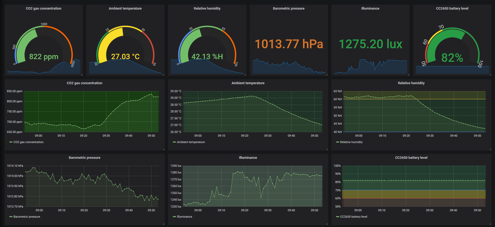
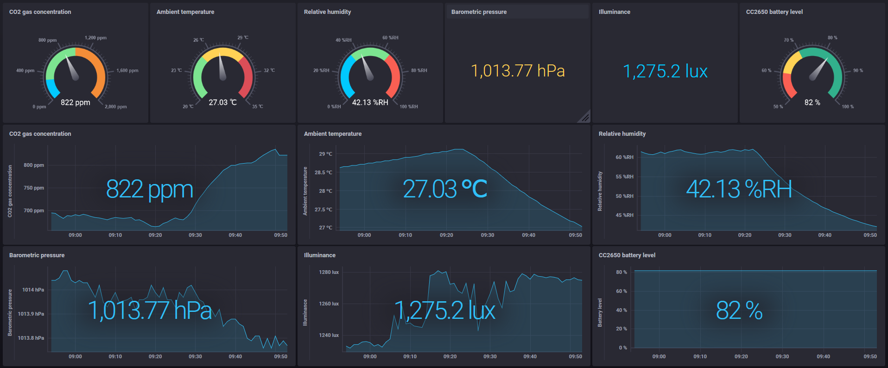

# rainy - a tiny tool for iot data collection and monitoring
rainy is a tiny tool for IoT data collection and monitoring.
rainy supports [TI SensorTag CC2650](http://processors.wiki.ti.com/index.php/CC2650_SensorTag_User's_Guide) and [MH-Z19B](https://www.winsen-sensor.com/d/files/infrared-gas-sensor/mh-z19b-co2-ver1_0.pdf) as IoT devices, communicates with CC2650 by [bluez-dbus](https://github.com/hypfvieh/bluez-dbus), and communicates with MH-Z19B by [java-simple-serial-connector](https://code.google.com/archive/p/java-simple-serial-connector/), and acquires each data.
These data can be sent to [InfluxDB](https://www.influxdata.com/) (Time Series Database) for visualization, or sent to MQTT Broker to be used as a data source for any other purposes.

rainy runs on [Apache Felix](https://felix.apache.org/) (OSGi). I think that rainy can be embedded in the environment without OSGi.

I releases this in the form of the Eclipse plug-in project and zip file. You need Java 8 or higher.
I have confirmed that it works in Raspberry Pi 3B ([Raspbian Buster Lite OS](https://www.raspberrypi.org/downloads/raspbian/) (2019-07-10)).

The following figure is overview of rainy.

</img>

---
<h2>Table of Contents</h2>

- [Setup OS](#setup_os)
- [Setup sending data](#setup_sending_data)
  - [Install InfluxDB and startup](#install_influxdb)
  - [Install Mosquitto (MQTT Broker) and startup](#install_mosquitto)
- [Install visualization tools](#install_visualization)
  - [Install Grafana and startup](#install_grafana)
  - [Install Chronograf and startup](#install_chronograf)
- [Configuration - rainy/conf](#configuration)
  - [rainy.properties](#rainy_properties)
  - [Setting the connection for sending data](#setting_connection_sending_data)
    - [InfluxDB - influxdb.properties](#influxdb_properties)
    - [MQTT - mqtt.properties](#mqtt_properties)
  - [Setting sensors](#setting_sensors)
    - [CC2650 - cc2650.properties](#cc2650_properties)
    - [MH-Z19B - mhz19b.properties](#mhz19b_properties)
- [Run rainy](#run_rainy)
  - [Output sensor values to the log file](#output_sensor_value)
  - [Check the database name for each device created in InfluxDB](#check_database)
- [Create dashboards with visualization tools](#create_dashboards)
  - [Case Grafana](#case_grafana)
  - [Case Chronograf](#case_chronograf)
- [Check the data sent to MQTT broker](#check_mqtt_data)
- [Limitations](#limitations)
- [Bundle list](#bundle_list)
- [P.S.](#ps)

---

<h2 id="setup_os">Setup OS</h2>

Please refer to [here](https://github.com/s5uishida/mh-z19b-driver) for setting RaspberryPi 3B as an environment for running rainy.
Both Bluetooth and serial communication can be enabled.

<h2 id="setup_sending_data">Setup sending data</h2>

rainy supports InfluxDB and MQTT broker as sending data.

<h3 id="install_influxdb">Install InfluxDB and startup</h3>

I am using [InfluxDB](https://www.influxdata.com/) on Ubuntu 18.04.
The installation is as follows from [here](https://portal.influxdata.com/downloads/).
```
# wget https://dl.influxdata.com/influxdb/releases/influxdb_1.7.7_amd64.deb
# dpkg -i influxdb_1.7.7_amd64.deb
# systemctl enable influxdb.service
# systemctl start influxdb.service
```

<h3 id="install_mosquitto">Install Mosquitto (MQTT Broker) and startup</h3>

I am using [Mosquitto](https://mosquitto.org/) as MQTT broker on Ubuntu 18.04.
The installation is as follows.
```
# apt-get update
# apt-get install mosquitto
# apt-get install mosquitto-clients
# systemctl enable mosquitto.service
# systemctl start mosquitto.service
```

<h2 id="install_visualization">Install visualization tools</h2>

<h3 id="install_grafana">Install Grafana and startup</h3>

I am using [Grafana](https://grafana.com/) on Ubuntu 18.04. The installation is as follows from [here](https://grafana.com/grafana/download?platform=linux).
```
# wget https://dl.grafana.com/oss/release/grafana_6.2.5_amd64.deb
# dpkg -i grafana_6.2.5_amd64.deb
# systemctl enable grafana-server.service
# systemctl start grafana-server.service
```

<h3 id="install_chronograf">Install Chronograf and startup</h3>

I am using [Chronograf](https://www.influxdata.com/time-series-platform/chronograf/) on Ubuntu 18.04. The installation is as follows from [here](https://portal.influxdata.com/downloads/).
```
# wget https://dl.influxdata.com/chronograf/releases/chronograf_1.7.12_amd64.deb
# dpkg -i chronograf_1.7.12_amd64.deb
# systemctl enable chronograf.service
# systemctl start chronograf.service
```

<h2 id="configuration">Configuration - rainy/conf</h2>

<h3 id="rainy_properties">rainy.properties</h3>

- **`clientID`**  
  Set a unique client identifier for running rainy.
- **`cc2650`**  
  Set to true when using CC2650. default is `false`.
- **`mhz19b`**  
  Set to true when using MH-Z19B. default is `false`.

<h3 id="setting_connection_sending_data">Setting the connection for sending data</h3>
  
<h4 id="influxdb_properties">InfluxDB - influxdb.properties</h4>

- **`influxDBUrl`**
- **`userName`**
- **`password`**
- `dataOnly`  
  Set to true when collecting only data. default is `true`.

<h4 id="mqtt_properties">MQTT - mqtt.properties</h4>

- **`brokerUri`**
- `userName`
- `password`
- **`clientID`**  
  First half string of unique client identifier when connecting to MQTT broker. After this string, this system adds a random string to complete the clientID string.
- `qos`  
  default is `0`.
- `topic`  
  Topic when publishing data to MQTT broker. default is `rainy`.

<h3 id="setting_sensors">Setting sensors<h3>

<h4 id="cc2650_properties">CC2650 - cc2650.properties</h4>

[Here](https://github.com/s5uishida/cc2650-driver) is also helpful.
- **`bluetoothAdapter`**  
  Bluetooth adapter name. default is `hci0`.
  Check the list of adapter names with the `hciconfig` command.
```
# hciconfig -a
hci0:   Type: Primary  Bus: UART
        BD Address: B8:27:EB:7D:0F:7D  ACL MTU: 1021:8  SCO MTU: 64:1
        UP RUNNING 
        RX bytes:28342 acl:441 sco:0 events:2265 errors:0
        TX bytes:34605 acl:441 sco:0 commands:1955 errors:0
        Features: 0xbf 0xfe 0xcf 0xfe 0xdb 0xff 0x7b 0x87
        Packet type: DM1 DM3 DM5 DH1 DH3 DH5 HV1 HV2 HV3 
        Link policy: RSWITCH SNIFF 
        Link mode: SLAVE ACCEPT 
        Name: 'raspberrypi'
        Class: 0x000000
        Service Classes: Unspecified
        Device Class: Miscellaneous, 
        HCI Version: 4.1 (0x7)  Revision: 0x168
        LMP Version: 4.1 (0x7)  Subversion: 0x2209
        Manufacturer: Broadcom Corporation (15)
```
- **`influxDB`**  
  Set to true when sending data to InfluxDB. default is `false`.
- **`mqtt`**  
  Set to true when sending data to MQTT broker. default is `false`.
- `prettyPrinting`  
  Set to true when indenting the log output of JSON format data. default is `false`.
- `readCrontab`  
  Set the schedule for sensing data in crontab format. default is every minute.
- `batteryLevel`  
  Set to true when getting battery level. default is `false`.
- Example of setting Temperature sensor
  - **`temperature`**  
    Set to true when using a Temperature sensor. default is `false`.
  - `temperatureNotify`  
    Set to true when using the notification function. default is `false`. When the notification function is enabled, the readCrontab schedule for Temperature sensor is disabled.
  - `temperatureNotificationPeriod`  
    Set the notification time interval in milliseconds. default is `1000`.
- Movement
  - `gyroscope`  
    Set to true when using a Gyroscope sensor. default is `false`.
  - `accelerometer`  
    Set to true when using a Accelerometer sensor. default is `false`.
  - `magnetometer`  
    Set to true when using a Magnetometer sensor. default is `false`.
  - `movementNotify`  
    Set to true when using the notification function. default is `false`. When the notification function is enabled, the readCrontab schedule for Movement sensor is disabled.
  - `movementNotificationPeriod`  
    Set the notification time interval in milliseconds. default is `1000`.
  - `wakeOnMotion`  
    Set to true when sending movement data when a shake is detected. It sends `Movement` data at a time interval specified by notification for 10 seconds. default is `false`.
  - `accelerometerRange`  
    Set Accelerometer range. default is `2`.
- **`devices`**  
  List the addresses of the target CC2650 devices. To check the address of CC2650, use `hcitool` command as follows.
```
# hcitool lescan
LE Scan ...
B0:B4:48:B9:92:86 (unknown)
B0:B4:48:B9:92:86 CC2650 SensorTag
```
After launching `hcitool` command, press the power button of CC2650 and the scan results will be displayed as above.

<h4 id="mhz19b_properties">MH-Z19B - mhz19b.properties</h4>

- **`portName`**  
  Set the serial port name. default is `/dev/ttyAMA0`.
- **`influxDB`**  
  Set to true when sending data to InfluxDB. default is `false`.
- **`mqtt`**  
  Set to true when sending data to MQTT broker. default is `false`.
- `prettyPrinting`  
  Set to true when indenting the log output of JSON format data. default is `false`.
- `readCrontab`  
  Set the schedule for sensing data in crontab format. default is every minute.

<h2 id="run_rainy">Run rainy</h2>

- start  
  Start rainy as follows.
```
# cd /path/to/rainy/bin
# sh rainy-start.sh
WARNING: An illegal reflective access operation has occurred
WARNING: Illegal reflective access by org.apache.felix.framework.ext.ClassPathExtenderFactory$DefaultClassLoaderExtender (file:/path/to/rainy-felix/bin/felix.jar) to method java.net.URLClassLoader.addURL(java.net.URL)
WARNING: Please consider reporting this to the maintainers of org.apache.felix.framework.ext.ClassPathExtenderFactory$DefaultClassLoaderExtender
WARNING: Use --illegal-access=warn to enable warnings of further illegal reflective access operations
WARNING: All illegal access operations will be denied in a future release
-> ps
START LEVEL 1
   ID   State         Level  Name
[   0] [Active     ] [    0] System Bundle (6.0.3)
[   1] [Active     ] [    1] bluetooth scanner (0.1.0)
[   2] [Active     ] [    1] bluez-dbus-osgi (0.1.2.201907161543)
[   3] [Active     ] [    1] java driver for ti sensortag cc2650 (0.1.0)
[   4] [Active     ] [    1] Apache Commons Lang (3.9.0)
[   5] [Active     ] [    1] cron4j-osgi (2.2.5)
[   6] [Active     ] [    1] dbus-java-with-java-utils-osgi (3.0.2)
[   7] [Active     ] [    1] Java client for InfluxDB (2.15)
[   8] [Active     ] [    1] Jackson-annotations (2.9.9)
[   9] [Active     ] [    1] Jackson-core (2.9.9)
[  10] [Active     ] [    1] jackson-databind (2.9.9.1)
[  11] [Active     ] [    1] java driver for mh-z19b - intelligent infrared co2 module (0.1.0)
[  12] [Active     ] [    1] A modern JSON library for Kotlin and Java (1.7.0)
[  13] [Active     ] [    1] MessagePack serializer implementation for Java (0.8.17)
[  14] [Active     ] [    1] Apache Felix Shell Service (1.4.3)
[  15] [Active     ] [    1] Apache Felix Shell TUI (1.4.1)
[  16] [Active     ] [    1] Apache ServiceMix :: Bundles :: jsr305 (3.0.2.1)
[  17] [Active     ] [    1] Apache ServiceMix :: Bundles :: okhttp (3.14.1.1)
[  18] [Active     ] [    1] Apache ServiceMix :: Bundles :: okio (1.15.0.1)
[  19] [Active     ] [    1] Apache ServiceMix :: Bundles :: retrofit (2.5.0.2)
[  20] [Active     ] [    1] Paho MQTT Client (1.2.1)
[  21] [Active     ] [    1] jSSC (Java Simple Serial Connector) (2.8.0)
[  22] [Active     ] [    1] OSGi LogService implemented over SLF4J (1.7.26)
[  23] [Active     ] [    1] osgi activator of rainy - a tiny tool for iot data collection and monitoring (0.1.0)
[  24] [Active     ] [    1] rainy - a tiny tool for iot data collection and monitoring (0.1.0)
[  25] [Active     ] [    1] slf4j-api (1.7.26)
[  26] [Resolved   ] [    1] slf4j-jdk14 (1.7.26)
-> 
```

- stop  
  Stop rainy as follows.
```
-> stop 0
```

<h3 id="output_sensor_value">Output sensor values to the log file</h3>

If you change the following logging level of `conf/logging.properties` to `INFO --> FINE` and restart rainy, the sensor values will be output to the log file `logs/rainy.log.0`.
```
#io.github.s5uishida.level=INFO
-->
io.github.s5uishida.level=FINE
```
The sample of the output log is as follows.
```
[/dev/ttyAMA0] co2:850 
[hci0] B0:B4:48:B9:92:86 obj:28.28125 amb:32.28125 
[hci0] B0:B4:48:B9:92:86 humidity:59.362793 
[hci0] B0:B4:48:B9:92:86 pressure:1012.27 
[hci0] B0:B4:48:B9:92:86 optical:227.28 
[hci0] B0:B4:48:B9:92:86 gyr[x]:-1.3198851 
[hci0] B0:B4:48:B9:92:86 gyr[y]:-0.2593994 
[hci0] B0:B4:48:B9:92:86 gyr[z]:0.7476806 
[hci0] B0:B4:48:B9:92:86 acc[x]:0.0056152344 
[hci0] B0:B4:48:B9:92:86 acc[y]:-0.007080078 
[hci0] B0:B4:48:B9:92:86 acc[z]:0.9707031 
[hci0] B0:B4:48:B9:92:86 mag[x]:127.0 
[hci0] B0:B4:48:B9:92:86 mag[y]:420.0 
[hci0] B0:B4:48:B9:92:86 mag[z]:302.0
```
In order to reduce writing to the SD card, it is usually recommended to set it to `INFO`.

<h3 id="check_database">Check the database name for each device created in InfluxDB</h3>

Check from the log file `logs/rainy.log.0`. In the following example, databases `RP3B_01__dev_ttyAMA0` for MH-Z19B, `B0_B4_48_B9_92_86` and `B0_B4_48_ED_B6_04` for CC2650 were created. Note that InfluxDB will not do anything if the database already exists.
```
execute - CREATE DATABASE RP3B_01__dev_ttyAMA0
...
execute - CREATE DATABASE B0_B4_48_B9_92_86
...
execute - CREATE DATABASE B0_B4_48_ED_B6_04
```
These database names are required for the visualization tools Grafana and Chronograf to connect to InfluxDB.

<h2 id="create_dashboards">Create dashboards with visualization tools</h3>

Visualization tools can be connected to InfluxDB to monitor time-series sensor data.

<h3 id="case_grafana">Case Grafana</h3>

Please refer to Getting started of [Grafana site](https://grafana.com/docs/) for how to use Grafana.  
The following figure is a sample image of a dashboard.
</img>

<h3 id="case_chronograf">Case Chronograf</h3>

Please refer to Getting started of [Chronograf site](https://docs.influxdata.com/chronograf/v1.7/) for how to use Chronograf.  
The following figure is a sample image of a dashboard.
</img>

<h2 id="check_mqtt_data">Check the data sent to MQTT broker</h2>

Check the data sent to the MQTT broker using the MQTT client command as follows:
```
# mosquitto_sub -d -t rainy/B0_B4_48_B9_92_86
Client mosqsub|2239-u1804 sending CONNECT
Client mosqsub|2239-u1804 received CONNACK
Client mosqsub|2239-u1804 sending SUBSCRIBE (Mid: 1, Topic: rainy/B0_B4_48_B9_92_86, QoS: 0)
Client mosqsub|2239-u1804 received SUBACK
Subscribed (mid: 1): 0
Client mosqsub|2239-u1804 received PUBLISH (d0, q0, r0, m0, 'rainy/B0_B4_48_B9_92_86', ... (649 bytes))
{"deviceID":"B0:B4:48:B9:92:86","clientID":"RP3B-01","samplingDate":"2019-07-31 01:06:00.035","samplingTimeMillis":1564574760035,"firmwareVersion":"1.33 (Nov  9 2016)","batteryLevel":{"value":75,"unit":"%"},"objectTemperature":{"value":26.34375,"unit":"deg C"},"ambientTemperature":{"value":30.46875,"unit":"deg C"},"humidity":{"value":53.363037,"unit":"%"},"pressure":{"value":1012.78,"unit":"hPa"},"optical":{"value":232.4,"unit":"lux"},"gyroscope":{"x":-1.4495848,"y":-0.2975464,"z":0.67901605,"unit":"deg/s"},"accelerometer":{"x":0.0056152344,"y":-0.010009766,"z":0.9680176,"unit":"G"},"magnetometer":{"x":107.0,"y":431.0,"z":305.0,"unit":"uT"}}
```

<h2 id="limitations">Limitations</h2>

- Only one Bluetooth adapter can be used.
- Only a few CC2650 (Bluetooth devices) can be used at the same time. (Restriction of Bluetooth chip)
- When the connection with CC2650 is lost, it may not recover automatically.

<h2 id="bundle_list">Bundle list</h2>

The following bundles I created follow the MIT license.
- [bluetooth-scanner 0.1.0](https://github.com/s5uishida/bluetooth-scanner)
- [cc2650-driver 0.1.0](https://github.com/s5uishida/cc2650-driver)
- [mh-z19b-driver 0.1.0](https://github.com/s5uishida/mh-z19b-driver)
- [rainy-activator 0.1.0](https://github.com/s5uishida/rainy-activator)
- [rainy 0.1.0](https://github.com/s5uishida/rainy)

Please check each license for the following bundles used in addition to these.
- [SLF4J 1.7.26](https://www.slf4j.org/)
- [Apache Commons Lang 3.9](https://commons.apache.org/proper/commons-lang/)
- [dbus-java-with-java-utils-osgi 3.0.2](https://github.com/s5uishida/dbus-java-with-java-utils-osgi)
- [bluez-dbus-osgi 0.1.2](https://github.com/s5uishida/bluez-dbus-osgi)
- [cron4j-osgi 2.2.5](https://github.com/s5uishida/cron4j-osgi)
- [influxdb-java-osgi 2.15.0](https://github.com/s5uishida/influxdb-java-osgi)
- [msgpack-core-osgi 0.8.17](https://github.com/s5uishida/msgpack-core-osgi)
- [moshi-osgi 1.7.0](https://github.com/s5uishida/moshi-osgi)
- [Jackson 2.9.9](https://github.com/FasterXML/jackson) [annotations](https://mvnrepository.com/artifact/com.fasterxml.jackson.core/jackson-annotations/2.9.9), [core](https://mvnrepository.com/artifact/com.fasterxml.jackson.core/jackson-core/2.9.9), [databind](https://mvnrepository.com/artifact/com.fasterxml.jackson.core/jackson-databind/2.9.9.1)
- [Apache Felix 6.0.3](https://felix.apache.org/)
- [Apache Felix Shell 1.4.3](https://felix.apache.org/documentation/subprojects/apache-felix-shell.html)
- [Apache Felix Shell TUI 1.4.1](https://felix.apache.org/documentation/subprojects/apache-felix-shell-tui.html)
- [JSR 305 3.0.2](https://mvnrepository.com/artifact/org.apache.servicemix.bundles/org.apache.servicemix.bundles.jsr305/3.0.2_1)
- [Okio 1.15.0](https://mvnrepository.com/artifact/org.apache.servicemix.bundles/org.apache.servicemix.bundles.okio/1.15.0_1)
- [OkHttp 3.14.1](https://mvnrepository.com/artifact/org.apache.servicemix.bundles/org.apache.servicemix.bundles.okhttp/3.14.1_1)
- [Retrofit 2.5.0](https://mvnrepository.com/artifact/org.apache.servicemix.bundles/org.apache.servicemix.bundles.retrofit/2.5.0_2)
- [Eclipse Paho Client Mqttv3 1.2.1](https://mvnrepository.com/artifact/org.eclipse.paho/org.eclipse.paho.client.mqttv3/1.2.1)
- [JSSC (Java Simple Serial Connector) 2.8.0](https://mvnrepository.com/artifact/org.everit.osgi.bundles/org.everit.osgi.bundles.org.scream3r.jssc/2.8.0)

I would like to thank the authors of these very useful codes, and all the contributors.

<h2 id="ps">P.S.</h2>

With Raspberry Pi 4B (4GB memory model), InfluxDB and Grafana may be able to run on one with rainy.
In this case, it is not necessary to prepare the other machine for InfluxDB and Grafana, and I hope that one RP4 can perform from sensor data collection to visualization.
